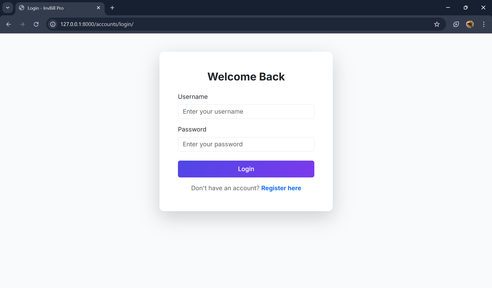
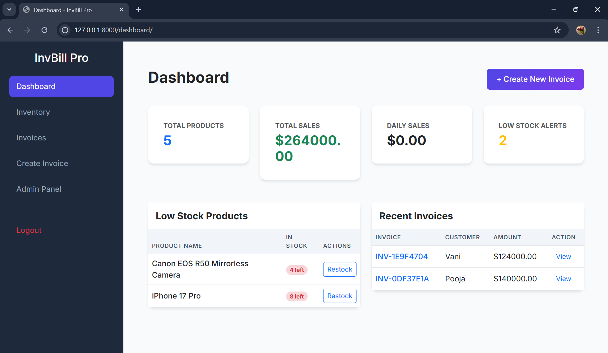
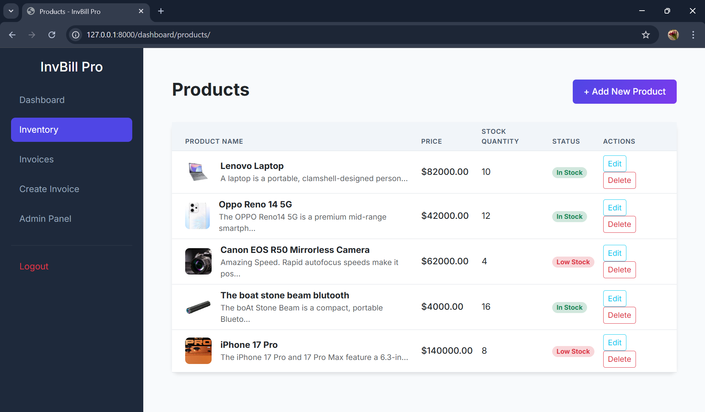
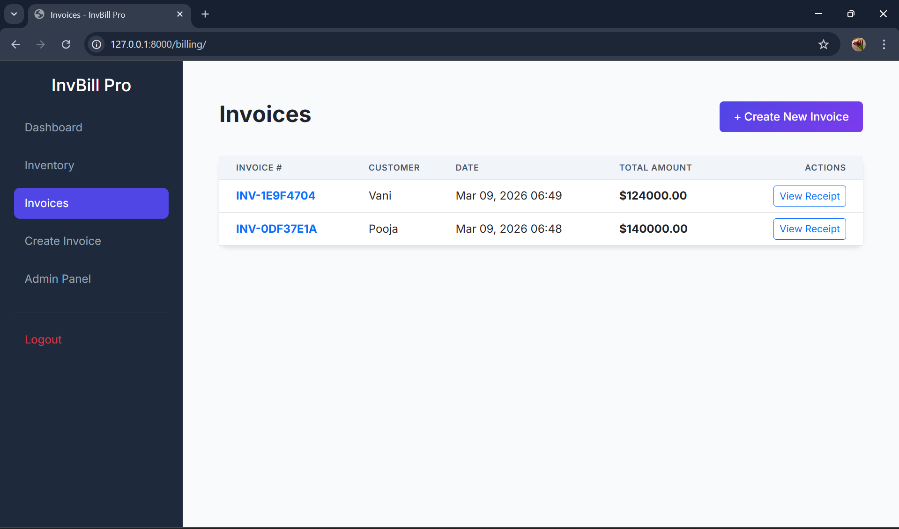
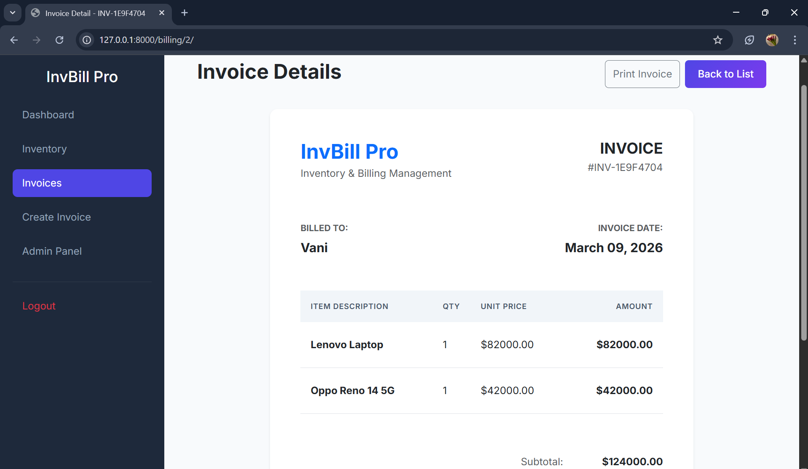
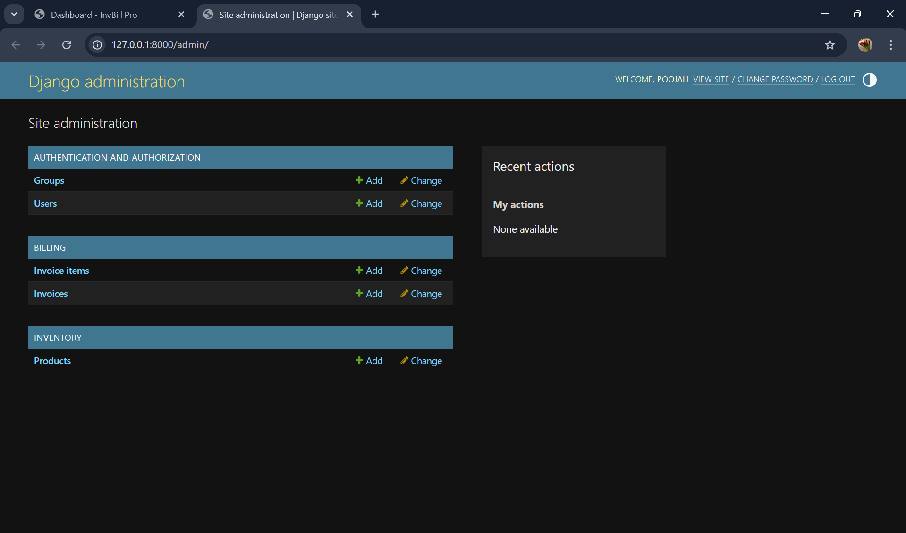

# 📦 Inventory & Billing Management System

A full-stack web application built using Python and Django that helps businesses manage their inventory and billing processes efficiently.

---

# 🎯 Project Overview

The Inventory & Billing Management System allows businesses to:

• Manage products  
• Track stock levels  
• Generate invoices  
• Monitor sales  

This project demonstrates full-stack web development with Django.

---

# 🚀 Features

## User Authentication
- Secure login system
- Role-based access

## Inventory Management
- Add new products
- Update product details
- Delete products
- Monitor stock levels

## Billing System
- Generate invoices
- Record sales transactions
- Track customer purchases

---

# 🛠 Technology Stack

Backend
- Python
- Django

Frontend
- HTML
- CSS
- JavaScript

Database
- SQLite / MySQL

Tools
- Git
- GitHub
- VS Code

---
---

# 🏗️ System Architecture

The application follows a **three-tier architecture**.

Presentation Layer
- HTML templates
- CSS styling
- JavaScript interaction

Application Layer
- Django framework
- Business logic
- Request handling

Data Layer
- SQLite / MySQL database
- Data storage and retrieval

---

# 📊 Database Schema

Tables used in the system:

Products
- id (Primary Key)
- name
- quantity
- price

Customers
- id
- name
- contact

Invoices
- id
- product_id
- quantity
- total_price
- created_at

---

# 📁 Project Structure

## 📁 Project Structure

```
inventory-management-system/
│
├── accounts/                # User authentication
├── billing/                 # Invoice management
├── inventory/               # Product management
│
├── templates/               # HTML templates
│   ├── accounts/
│   ├── billing/
│   └── inventory/
│
├── static/                  # CSS, JavaScript, images
│   ├── css/
│   ├── js/
│   └── images/
│
├── screenshots/             # Application screenshots
│   ├── dashboard.png
│   ├── inventory.png
│   └── invoice.png
│
├── documentation/           # Project documentation
│   ├── API.md
│   ├── SRS.md
│   ├── SDS.md
│   └── TestPlan.md
│
├── manage.py                # Django project runner
├── requirements.txt         # Python dependencies
├── .gitignore               # Ignored files
└── README.md                # Project documentation
```

---

# ⚙ Installation

Clone repository

git clone https://github.com/yourusername/inventory-management-system.git

Navigate to project

cd inventory-management-system

Create virtual environment

python -m venv myenv

Activate environment

myenv\Scripts\activate

Install dependencies

pip install -r requirements.txt

Run server

python manage.py runserver

Open browser

http://127.0.0.1:8000

----

# 📊 Future Improvements

• Barcode scanning support  
• Export invoice as PDF  
• Email invoice system  
• Sales analytics dashboard


## Application Screenshots













